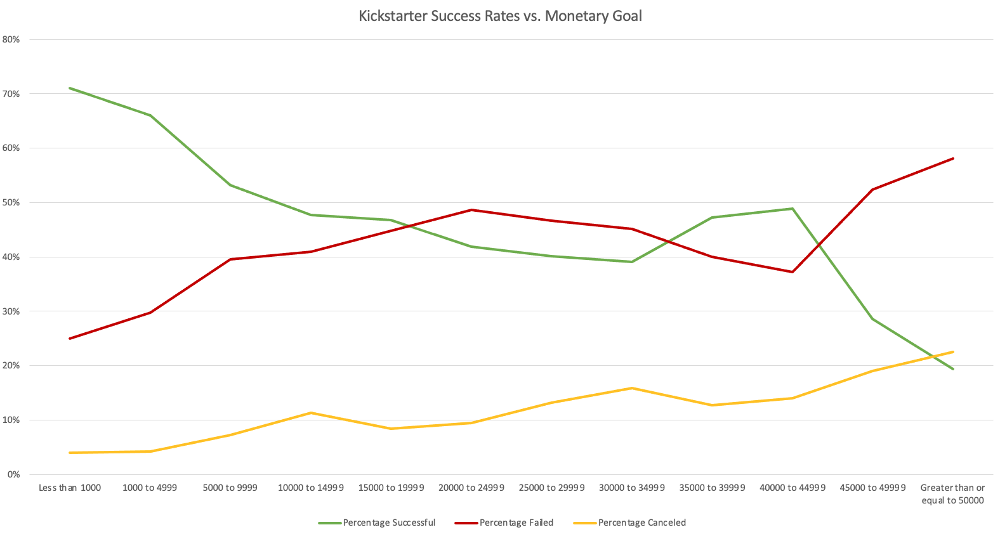

# Kickstarter-campaigns

Kickstarter campaign analysis that genereates insight through tables, graphs, and statistical summaries. 

## State and Percent Funded

Conditional formatting is used to visualize how much of the campaign's funding goal was reached and what state the campaign is in (successful, failed, live, or cancelled). A column was added to show the average donation of each backer and category/sub-category were split into separate columns.

## Category and Sub-category
Pivot tables for category and sub-category along with stacked bar charts to visualize the state of campaigns based on their area of interest. Both pivot charts can be filtered by country and the sub-category chart can be filtered by parent category. 

## Monetary goal 
Line charts that visualize monetary goal separated into bins and the state of the campaigns. Overall, we see that campaigns that cost less than $10,000 have the highest rates of success. 

## Date created 
Time analysis of kickstarter campaigns. 

## Backers
Statistical summary of the number of campaign backers. 
